---

# 🛒 DigiShop React Web Application

A modern, full-featured e-commerce web application inspired by DigiKala,
built with React and focused on clean architecture, performance optimization,
scalable state management, and role-based admin management.

This project goes beyond a simple clone and implements real-world
e-commerce workflows including admin dashboards, product management,
activity logging, and optimized user experience.

## 🖼 Screenshots

---

### 🏠 Home Page
| light | dark |
|---------|--------|
|  |  |
|  | 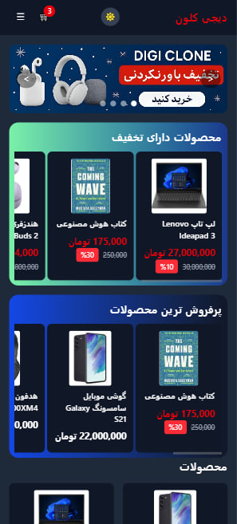 |
|  |  |

---

### 🛍 Product Page
| Desktop | Mobile | Mobile dark |
|---------|--------|--------|
|  |  | |

#### 💬 Comments
| Desktop | Mobile | Mobile dark |
|---------|--------|--------|
| 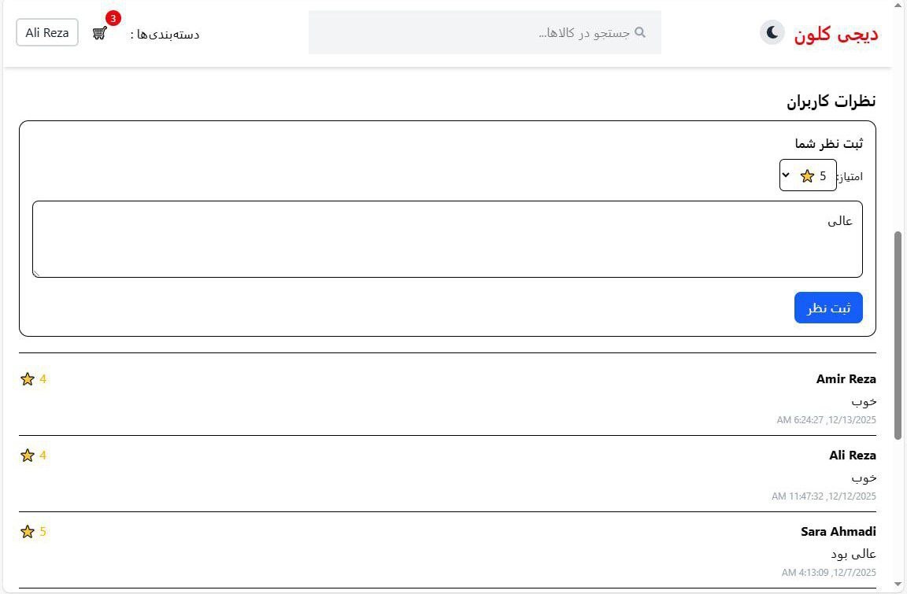 |  |  |

---

### 🛒 Cart
| Desktop | Mobile | Mobile-Dark |
|---------|--------|-------------|
| 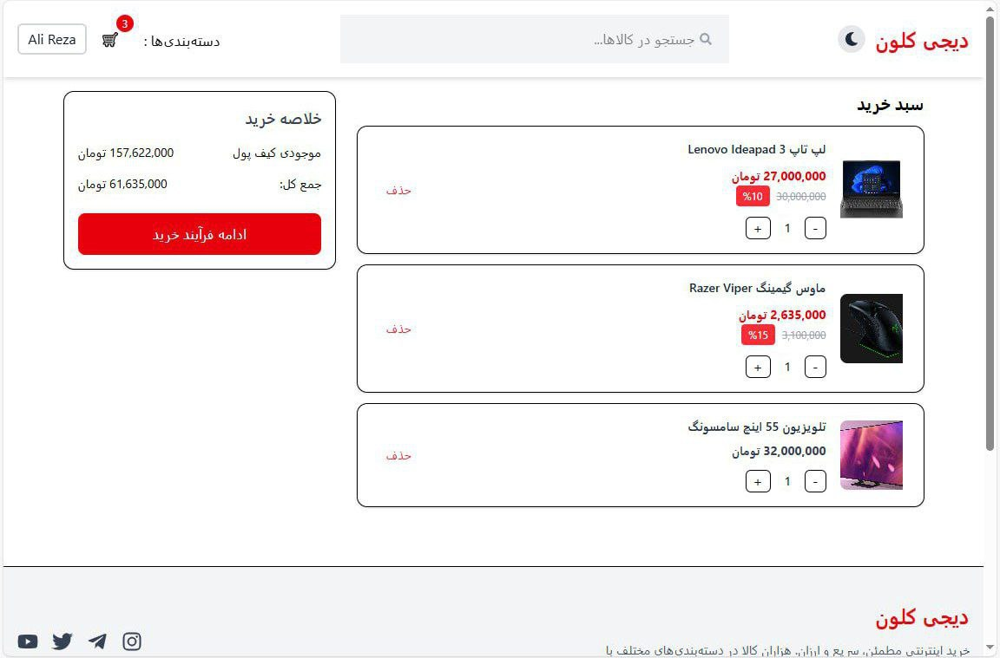 | 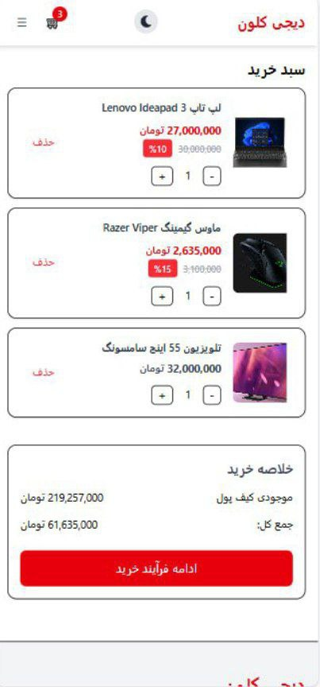 | 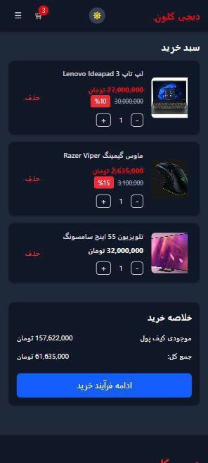 |

---

### 🔐 Authentication
| Login | Register |
|-------|----------|
|  |  |

---

### 📦 Orders
| Desktop | Mobile |
|---------|--------|
| 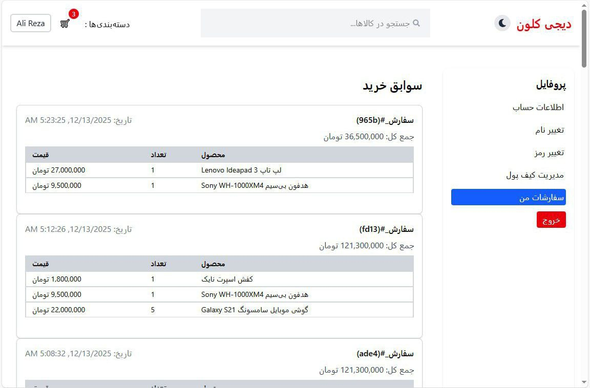 | 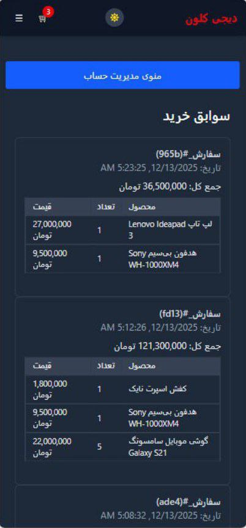 |

---

### 🔑 Change Profile
| profile | charge wallet | password | name |
|---------|--------------|----------|------|
|  |  |  |  |

---

### 🏠 Admin Dashboard
| Update Product | Admin Logs |
|---------|--------|
| 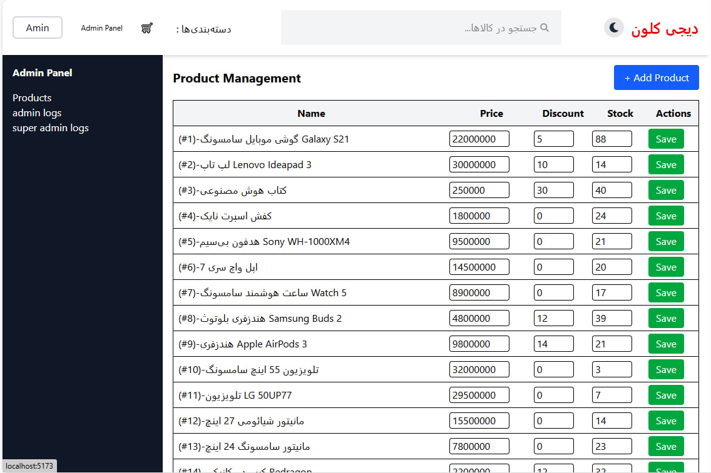 | 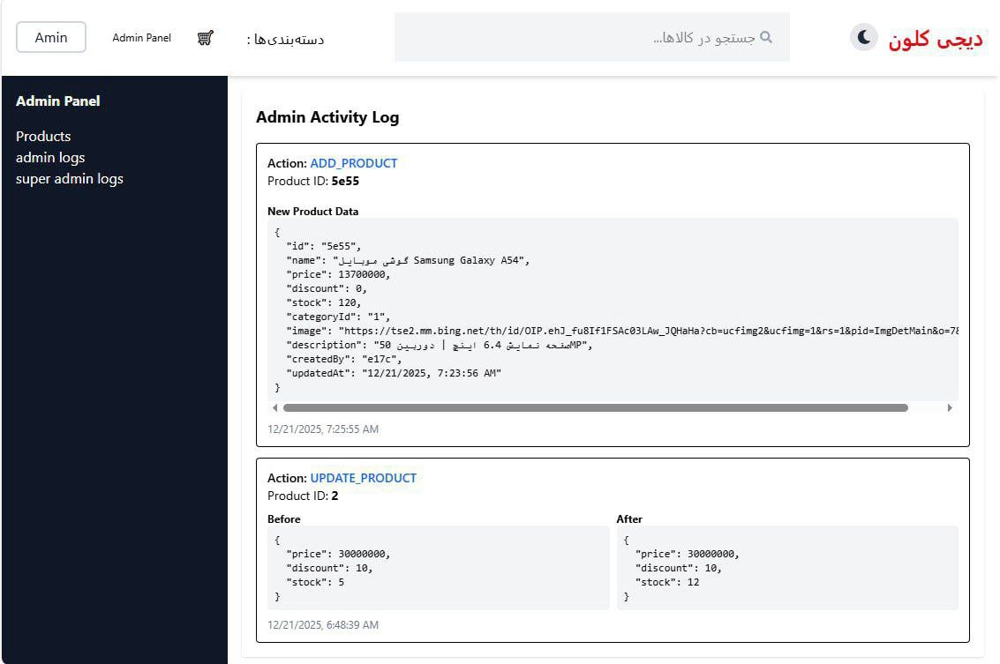 |
| 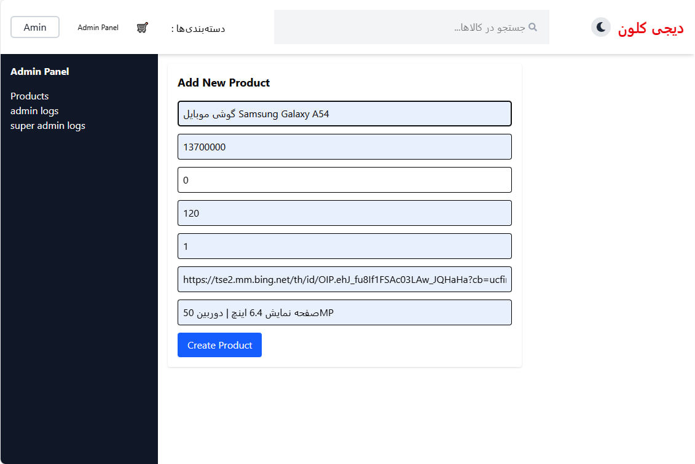 | 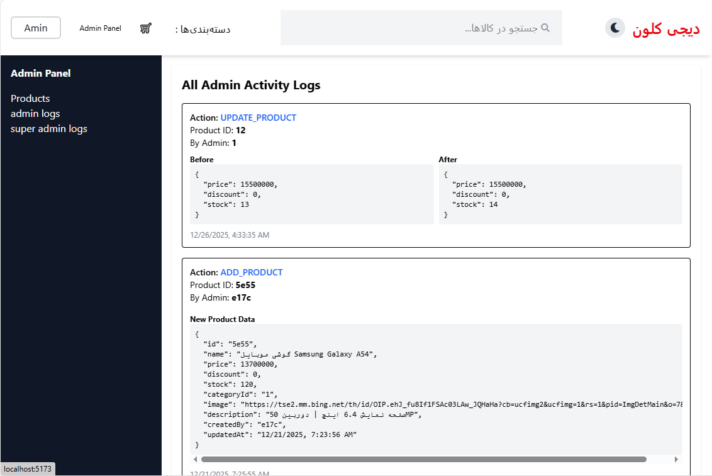 |

## 📦 Tech Stack

### Frontend
- React 18
- React Router v6
- Context API + useReducer
- Tailwind CSS (Dark / Light Mode)
- Axios
- React Icons

### Backend (Mock)
- JSON Server

## ✨ Features

### 🔐 Authentication (Mock – No JWT)
- Login, Register, Logout
- Persistent authentication with localStorage
- Protected routes
- Reducer-based Auth Context
- Profile management (update name, change password, wallet)

### 🛍 Products
- Infinite scroll product listing
- Product details page
- Category-based filtering
- Discount system
- Dynamic price calculation
- Rating system based on latest user comments
- Product comments (only for purchased products)

### 🧺 Cart
- Cart Context with reducer
- Add, remove, update quantity
- Cart persistence
- Cart-product join logic
- Debounced search integration
- Optimized with useMemo, useCallback, React.memo

### 💳 Payment & Orders
- Wallet-based payment simulation
- Order creation and storage
- Wallet balance deduction
- Purchase history
- Top-selling products calculation

### 🏠 Home Page
- Banner section
- Discounted products horizontal slider
- Top-selling products slider
- Infinite loading product grid
- Fully responsive layout

### 👤 Profile Page
- Desktop sidebar and mobile adaptive layout
- Account info management
- Wallet charge
- Password change with validation
- Order history
- Dark mode support

### 🎨 UI / UX
- Responsive design (mobile, tablet, desktop)
- Dark / Light mode
- Loading and skeleton states
- Horizontal scroll sections
- Smooth transitions

---

## 🛠 Admin Dashboard

Role-based admin management system.

### Admin
- Add new products
- Update products (price, discount, stock)
- Server-synced changes
- Personal activity logs
- Before/After product comparison

### Super Admin
- View all admin activity logs
- Full visibility of all product changes

### Logging System
- Action type (ADD_PRODUCT, UPDATE_PRODUCT)
- Admin ID
- Product ID
- Timestamp
- Before / After state

## ⚡️ Performance Optimization
- React.memo
- useMemo
- useCallback
- useRef
- Suspense & lazy loading
- Debounced inputs
- Optimized context updates

## Performance & UX Enhancements

This project includes several optimizations to improve performance and user experience:

- ⚡️ Lazy Loading: Components and images are loaded only when needed to reduce initial load time.
- 🧠 Memoization: React.memo, useMemo, and useCallback are used to prevent unnecessary re-renders.
- 🌐 Responsive Design: Fully responsive layout for desktop, tablet, and mobile devices.
- 🌙 Dark/Light Mode: Seamless toggle between dark and light themes for better accessibility.
- 🛒 Optimized Cart & LocalStorage: Cart state is efficiently stored and retrieved from localStorage.
- 🔄 Infinite Scroll: Smooth product listing experience with optimized scroll performance.
- ⏱️ Debounced API Calls: Search and filter API requests are debounced to reduce unnecessary network calls and improve performance.

## 🗂 Project Structure

src/ ├── api/ ├── components/ │   ├── home/ │   ├── product/ │   ├── layout/ │   ├── profile/ ├── context/ ├── pages/ ├── hooks/ ├── utils/ └── App.jsx

## 🔧 Installation & Run

`bash

npm install

npx json-server --watch db.json --port 3000

npm run dev

📌 Future Improvements

Server-side pagination

Stock management

Real payment gateway

SEO optimization

Testing (unit & integration)

🧠 Key Concepts

Scalable Context architecture

Reducer-based global state

Clean separation of concerns

Mock backend integration

Advanced React optimization patterns

Real-world e-commerce flows

👨‍💻 Author

Amin
GitHub: https://github.com/amin13m

⭐️ Support

If you like this project, give it a star ⭐️

---
